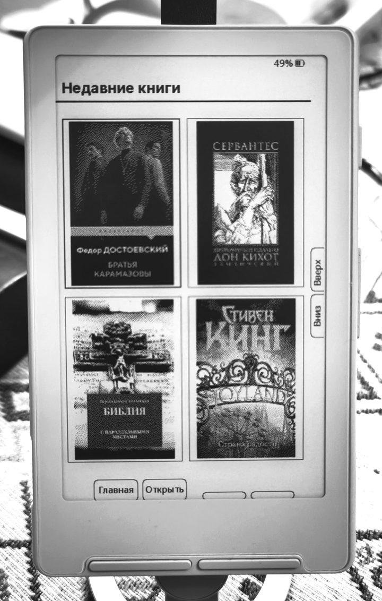
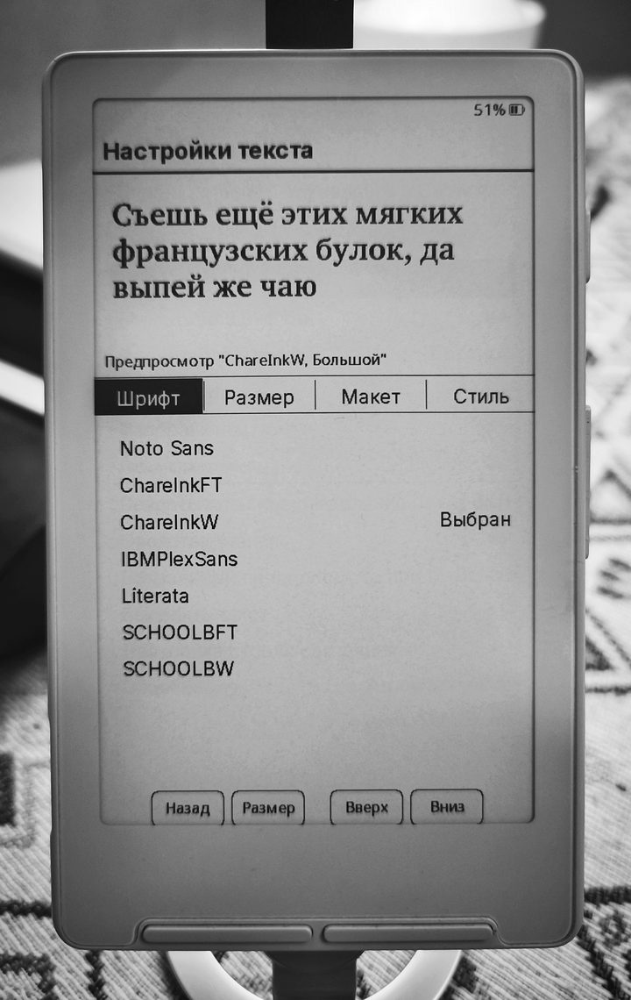

<div align="center">
  
</div>

<p align="center">
  
  
  
  
</p>

Прошивка для электронных книг **XTEINK X3 и X4**.

Текущая версия — **PaperioReader 2.1.6**.

## Что нового в 2.1.6

- **Размеры шрифта цифрами.** В основных настройках текста на вкладке «Размер» появился переключатель «Размеры цифрами». Для встроенного шрифта доступны 12, 14, 16 и 18 pt, для SD-шрифта — все установленные размеры этого семейства.
- **Отдельный размер для книги.** В меню чтения EPUB/FB2 → «Переопределения для книги» → «Размер шрифта книги» используется тот же цифровой режим. Выбор сохраняется для этой книги и применяется сразу; «По умолчанию» возвращает общий размер. После смены семейства список соответствует его доступным размерам. Быстрое меню также поддерживает цифровые размеры.
- **Исправлена подпись настройки.** «Размер шрифта интерфейса» переименован в «Размер шрифта книги», поскольку он управляет текстом книги.
- **Исправлено быстрое возобновление после сна.** При автоматическом засыпании сохраняются показанная страница и позиция чтения; фоновые построения страниц больше не должны подменять изображение для сна.

При выключенном цифровом режиме остаются привычные названия размеров. Изменения цифрового выбора проверены пользователем на ридере в тестовой сборке `2.1.5-font-size-fix3`; релиз 2.1.6 содержит тот же код с обновлённой версией и документацией.

## Что нового в 2.1.4

- **Переключение Paperio ↔ inkMOD без повторной прошивки.** В меню «Обновление системы» появился пункт «Переключить прошивку»: проверка второго слота, показ имени и версии, подтверждение перезагрузки.
- **Проверка установленного образа.** Пустой, повреждённый образ или образ для другого чипа выбрать нельзя. Обычные обновления Paperio сохраняют механизм подтверждения запуска и аварийного восстановления.
- **Инструкция для двух прошивок.** Ниже описаны первоначальная установка и переход в обе стороны. Пользователь подтвердил работу переключения на физическом ридере в тестовой сборке; релизная сборка отличается номером версии.

**OTA и обновление с SD заменяют второй слот. Если там inkMOD, обновление из Paperio сотрёт inkMOD. Само переключение слотов ничего не стирает.**

[Установка и переключение Paperio ↔ inkMOD](#переключение-paperio--inkmod).

## Что нового в 2.1.2

- **Исправлен возврат к предыдущей прошивке при выборе USB.** Старый пункт ошибочно загружал второй OTA-раздел, где могла находиться резервная версия Paperio. Опасное переключение удалено.
- **«Передача по USB» работает в текущей прошивке.** Открывается встроенный USB Serial; обычный USB-диск в Finder/Проводнике не создаётся. Аварийное восстановление сохранено.
- **Инструкции и файлы для компьютера.** Ниже описаны утилита `serial_transfer.py` для разных форматов и отдельный вариант плагина MicroReader для Calibre, адаптированный к Paperio (EPUB).

[Перейти к инструкции передачи файлов](#передача-файлов-по-usb).

## Что нового в 2.1.1

- **Ускорена первоначальная индексация FB2 и FB2.ZIP.** Длинный раздел разбирается сразу для нескольких виртуальных глав; повторные чтения заголовков и текста используют общий буфер. Сохранены точные переходы к абзацам и ячейкам таблиц.
- **Исправлено переполнение стека при подготовке FB2.** Буферы проверки и преобразования кодировки перенесены в проверяемые выделения памяти.
- **Подтверждение успешного запуска и аварийное восстановление.** Рабочая версия подтверждается после минуты устойчивой работы; серия аварий может вызвать возврат к проверенной предыдущей версии или запуск восстановления с SD. Условия и ограничения описаны [ниже](#аварийное-восстановление).

Проверены 463 автоматических теста, варианты кодировок и ZIP, сохранение целей сносок и повторное открытие. На тестовых книгах объём чтения при индексации уменьшился на 8–29%, а для длинного раздела с внутренними ссылками — в 4,5 раза. Это измерения настольного конвейера, а не времени на ридере. Аппаратная проверка новых сценариев аварийного отката ещё не выполнена.

## Что нового в 2.1.0

- **Поддержка FB2 и FB2.ZIP.** Книги открываются прямо с SD-карты, без предварительного преобразования на компьютере.
- **Оглавление с названиями глав, обложки и иллюстрации.** Исправлены потеря обложек при переключении между книгами и обработка больших FB2.
- **Сноски и внутренние ссылки FB2.** Поддерживаются примечания, параллельные места и переходы к отдельным абзацам, в том числе после повторного открытия книги. Исправлена ошибка «Цель ссылки не найдена» для сохранённого индекса.
- **Индексация с сохранением результата.** Подготовленная книга открывается без лишней надписи «Индексация». Индексы больших книг хранятся на SD-карте, что снижает расход оперативной памяти; исправлены связанные с открытием FB2 перезагрузки.
- **Все улучшения 1.2.2.** В теме «Мини» отображаются текущая и общая страницы вместе с процентом чтения, когда эти данные доступны. Добавлены сохранение и восстановление настроек кнопок через файл `button-settings.json` на SD-карте.

Подробности и ограничения формата описаны в разделе [Чтение FB2](#чтение-fb2).

## Что нового в 1.2.1

- **Выделение текста прямо в сносках.** Сохранённые выделения помнят адрес примечания и открываются в том же окне.
- **Словарь в окне сноски.** Можно выбрать слово, посмотреть определение и вернуться к примечанию; доступен выбор установленного словаря.
- **Механика сносок сохранена из 1.2.0.** Прежняя вёрстка, короткое окно, вложенные переходы, полный текст и возврат в книгу. Действия с текстом не открывают полную главу автоматически.
- **«Мини» по умолчанию.** Тема применяется для новых или сброшенных настроек; ранее выбранная тема сохраняется.
- Закладки остаются в основном режиме чтения; из меню сносок они убраны.

## Улучшения, добавленные в 1.2.0

- **Надёжные переходы по сноскам.** Исправлены ссылки на одноимённые файлы в разных папках EPUB и обработка якорей. Позиция чтения сохраняется перед открытием примечания; возврат восстанавливает исходную страницу.
- **Окно примечаний.** Доступны вложенные переходы, предыдущая и следующая сноска исходной страницы, полный текст и возврат в книгу. Полный текст открывает главу на месте примечания без ограничения предпросмотром.
- **Быстрое оглавление.** Боковые кнопки перемещают выделение сразу на пять названий глав; передние — на одно.
- **Три варианта системного шрифта.** «По умолчанию», «Тёмный» и **Golos Text** доступны в `Настройки → Экран → Шрифт интерфейса`. Выбор применяется к меню, настройкам и подписям кнопок и сохраняется после перезапуска.
- **Профили чтения для отдельной книги.** Обычный, крупный и компактный текст либо общие настройки — с сохранением выбранного размера и интервала.

Обновление доступно по OTA: `Настройки → Система → Обновление прошивки`.
Для ручной установки используйте [firmware.bin версии 2.1.6](https://github.com/Kapfilm/Paperio-Reader/releases/download/2.1.6/firmware.bin).


## Возможности

- EPUB, FB2, FB2.ZIP, TXT, XTC/XTC-H и Markdown.
- Быстрый рендеринг, фоновая индексация и осторожный прогрев ближайшего изображения.
- Сноски, оглавление, переходы по ссылкам и возврат к месту чтения.
- CSS и таблицы EPUB, плавающие изображения, переносы, надстрочный и подстрочный текст.
- Пользовательские шрифты и единое окно настроек текста с живым предпросмотром.
- Темы Mini и Lyra; недавние книги и библиотека с сеткой обложек 2×2.
- Закладки, именованные страницы, выделения и общий список закладок всех книг.
- Статистика чтения, часы, погода и синхронизация KOReader.
- Настраиваемые короткие, двойные и долгие нажатия кнопок.
- Прозрачные заставки сна, информационный слой и белый фон быстрого и полного сна.
- Wi-Fi, веб-доступ к файлам, установка прошивки с SD-карты и обновление по воздуху.

## Чтение FB2

Скопируйте книгу `.fb2` или `.fb2.zip` на SD-карту и откройте её в библиотеке.
Обычный `.zip`, внутри которого находится FB2, тоже распознаётся. Для архива
с несколькими FB2 открывается первый найденный файл; для отдельных книг
используйте отдельные архивы.

### Что поддерживается

- Название, автор, аннотация, заголовки и вложенные разделы. Оглавление использует названия глав из книги; у раздела без названия возможна служебная подпись.
- Встроенные обложки и иллюстрации. Обложка доступна на главном экране и в библиотеке, если она присутствует в книге и её изображение удалось прочитать.
- Основное оформление текста: абзацы, выделение полужирным и курсивом, цитаты, эпиграфы, стихи, надстрочный и подстрочный текст.
- Сноски, ссылки между разделами и ссылки на отдельные элементы текста, включая абзацы и ячейки таблиц. Это позволяет читать книги с большим числом примечаний и параллельных мест.
- Окно примечаний, вложенные переходы, открытие полного текста и возврат к месту чтения.
- Общие настройки текста, сохранение позиции чтения, закладки и выделения.
- UTF-8, Windows-1251 и KOI8-R; для старых кодировок важна корректная декларация кодировки в самом FB2.

### Первое и повторное открытие

При первом открытии прошивка подготавливает книгу и создаёт индексы на SD-карте.
Большая книга с тысячами разделов, сносок или изображений требует больше времени,
чем небольшой роман; архив дополнительно распаковывается. На карте должно быть
свободное место для распакованной книги и служебных файлов.

Результат подготовки сохраняется. При повторном открытии исправный индекс
используется сразу, без экрана «Индексация». Обложки и индексы не удаляются
только из-за открытия других книг. Очистка кеша, повреждение служебных файлов
или обновление формата индекса в новой прошивке могут потребовать подготовки
заново. При штатном обновлении индекса сохраняются позиция чтения и закладки.

### Ограничения

- Таблицы FB2 отображаются последовательно, ячейка за ячейкой, с сохранением текста и ссылок. Исходная сетка столбцов не воспроизводится.
- Подготовка книги и вёрстка страниц — разные операции. После изменения шрифта, размера или интервала может понадобиться перевёрстка; при открытии ещё не подготовленного фрагмента тоже возможна пауза. Отсутствие лишнего экрана индексации не отменяет эту работу.
- Первый переход к примечанию может требовать вёрстки его текста. Время открытия зависит от объёма фрагмента, изображений и скорости SD-карты.
- Переходы требуют существующей цели ссылки в исходном FB2. Повреждённые ссылки или отсутствующие изображения в самой книге прошивка восстановить не может.

## Книга-пример: сноски и примечания

**Библия с толкованиями блаженного Феофилакта Болгарского** — пример большого
EPUB с параллельными местами, перекрёстными ссылками и **6 268 толкованиями**.
Книга подходит для знакомства с окном примечаний, вложенными переходами и
возвратом к исходному стиху в Paperio Reader.

**[Скачать книгу в EPUB — 6,7 МБ](https://github.com/Kapfilm/Paperio-Reader/raw/refs/heads/Paperio-Reader/examples/bible-theophylact.epub)**

Скопируйте файл на SD-карту и откройте его в Paperio Reader. Выберите ссылку
на параллельное место или номер толкования, чтобы открыть примечание;
кнопка «Назад» возвращает к месту чтения.

В этой версии сохранены крупные заголовки по центру, интервалы между заголовками
и текстом, курсивные цитаты и обратные ссылки. Группировка внутренних страниц
оптимизирована для переходов; более быстрое открытие толкований подтверждено
на XTEINK X4 с Paperio. EPUBCheck: без ошибок и предупреждений.

## Выделение текста

В книге доступны три варианта выделения:

- **Маркер (светло-серый)** — мягкое выделение без затемнения текста.
- **Чёрный маркер** — контрастное выделение с белым текстом.
- **Подчёркивание** — сохраняет исходный фон страницы.

Нужный вариант можно выбрать через `Меню книги → Выделить текст`, а стиль по
умолчанию — в настройках чтения. Действие выделения также можно назначить на
короткое, двойное или долгое нажатие боковой кнопки.

## Словари

Paperio Reader поддерживает словари **StarDict**. Распакуйте каждый словарь в
отдельную папку на SD-карте:

```text
/dictionaries/Название словаря/
├── dictionary.idx
├── dictionary.dict       или dictionary.dict.dz
└── dictionary.ifo        необязательно
```

Файл `.idx` и выбранный файл `.dict` или `.dict.dz` внутри одной папки должны
иметь одинаковое основное имя. При первом поиске прошивка автоматически создаст
рядом быстрый индекс `.qidx`; для большого словаря это может занять некоторое
время. Если сжатый `.dict.dz` не открывается, используйте распакованный `.dict`.

Выбрать словарь можно через `Настройки → Чтение → Словарь` или непосредственно
из меню открытой книги через пункт `Выбрать словарь`.

Если выбрать **«Автоматически»**, прошивка будет сначала искать слово в наиболее
подходящих словарях с учётом алфавита запроса, а затем при необходимости проверит
остальные установленные словари. Это удобно, если на карте находятся, например,
русский толковый и англо-русский словари.

Для поиска откройте меню книги, выберите `Найти в словаре` и отметьте нужное
слово. Это действие также можно назначить на короткое, двойное или долгое
нажатие любой кнопки в настройках управления.

## Установка и обновление

### Устройства с USB-блокировкой (Xteink Unlocker)

Некоторые устройства Xteink, купленные в сторонних магазинах (например, на
AliExpress), поставляются с заводской USB-блокировкой. Если ваше устройство
заблокировано, вам нужно будет воспользоваться инструментом
[Xteink Unlocker](https://crosspointreader.com/#unlock-tool), прежде чем вы
сможете прошить Paperio Reader.

Первую версию Paperio Reader установите вручную файлом `firmware.bin`.
Последующие версии можно устанавливать на устройстве через:

`Настройки → Система → Обновление прошивки`

- [Последний релиз](https://github.com/Kapfilm/Paperio-Reader/releases/latest)
- [Скачать firmware.bin](https://github.com/Kapfilm/Paperio-Reader/releases/latest/download/firmware.bin)

## Переключение Paperio ↔ inkMOD

Начиная с версии 2.1.4 доступен пункт **Настройки → Обновление системы → Переключить прошивку**. Он показывает имя и версию образа во втором слоте, проверяет заголовок ESP32-C3, границы сегментов, контрольную сумму и SHA-256, если он присутствует. После подтверждения ридер перезагружается во вторую установленную прошивку. Содержимое разделов с прошивками не переписывается. Пустой или повреждённый образ выбрать нельзя.

Для первого использования обе прошивки нужно один раз установить в разные слоты:

1. Установите [Paperio 2.1.6](https://github.com/Kapfilm/Paperio-Reader/releases/download/2.1.6/firmware.bin) обычным обновлением с SD и оставьте рабочий экран открытым не менее минуты.
2. Через обновление с SD в Paperio установите совместимый **образ приложения inkMOD** для вашего ридера. Он займёт второй слот; Paperio останется в первом. Используйте версию inkMOD с переключателем слотов. Полный образ flash с загрузчиком и таблицей разделов для этой операции не подходит.
3. В inkMOD выберите переход в другой слот. Загрузится Paperio. Для возврата в inkMOD используйте новый пункт «Переключить прошивку» в Paperio.

Если обе прошивки уже установлены, достаточно переключаться между ними. При установке новой Paperio из старой Paperio занятый inkMOD второй слот будет перезаписан — тогда inkMOD нужно установить заново по шагу 2.

**Ограничения:** доступно два слота по 0x640000 байт (6,25 МиБ). Обычное обновление заменяет прошивку во втором слоте: постоянной третьей резервной копии нет. Проверена одинаковая разметка `partitions.csv` Paperio и [inkMOD](https://github.com/alpzoloto-sudo/inkmod/tree/b327a0887fa02d0dcd6c38e0808341d2b4a1fc2a); произвольная другая разметка не поддерживается. Проверка целостности не гарантирует совместимость настроек, SD-кэша и поведения сторонней прошивки.

Ручной переход и аварийное восстановление — разные операции. При ручном выборе проверенного образа он помечается выбранным без испытательного статуса загрузчика: сторонняя прошивка может не поддерживать подтверждение ESP-IDF. Это не подтверждает её устойчивую работу и не добавляет её автоматически в доверенную резервную копию Paperio. Обычные обновления Paperio по-прежнему используют подтверждение успешного запуска и аварийное восстановление, описанные ниже. Автоматический возврат из аварийной inkMOD зависит от самой inkMOD и загрузчика.

Пользователь подтвердил работу переключения на физическом ридере в тестовой сборке 2.1.3-dualboot-test1, на которой основан этот релиз. Идея переключателя и совместимая разметка — из проекта [alpzoloto-sudo/inkmod](https://github.com/alpzoloto-sudo/inkmod).

## Аварийное восстановление

### Когда запуск считается успешным

После обновления оставьте рабочий экран открытым не менее **60 секунд**. Подтверждение выполняется после отрисовки обычного экрана и минуты устойчивой работы основного цикла. Логотип загрузки, сон и экран восстановления не считаются успешным запуском. Долгая пауза основного цикла или незавершённая отрисовка откладывает подтверждение. В USB-логе подтверждению соответствует `Firmware confirmed after healthy UI/main-loop interval`.

Обычный сон или штатный перезапуск до подтверждения не признаёт прошивку исправной: испытательный статус сохраняется до полноценного рабочего запуска.

### Что происходит после аварий

Прошивка сохраняет сведения о текущем образе, проверенной предыдущей версии и серии аварий в служебной памяти NVS. После **трёх аварийных перезапусков подряд без успешного рабочего интервала** она пытается загрузить предыдущую рабочую версию. Учитываются программная авария (PANIC), watchdog и блокировка CPU. Сон, штатная перезагрузка, отключение питания и просадка напряжения этот счётчик не увеличивают. Устойчивый рабочий интервал сбрасывает серию аварий.

Возврат возможен только к известной проверенной копии: проверяются её идентификатор, загрузочные записи и целостность образа. Просто наличие второго раздела недостаточно — там может находиться другая, например USB-прошивка. Перед переключением сохраняется защита от бесконечного перехода между двумя неисправными версиями.

Если подходящей копии нет, она повреждена либо не удаётся безопасно сохранить состояние отката, вместо переключения открывается **восстановление с SD-карты**. Пользователь выбирает и подтверждает файл прошивки. Книги и закладки не используются как резервная копия прошивки; исправление повреждённой карты этим механизмом не выполняется.

### Как восстановить вручную с SD-карты

1. Скачайте совместимый `firmware.bin` из [нужного релиза](https://github.com/Kapfilm/Paperio-Reader/releases) и скопируйте на SD-карту. Удобно положить файл в корень; браузер также позволяет выбрать `.bin` в папке, имя `firmware.bin` не обязательно.
2. При включении или пробуждении **кнопкой питания** удерживайте боковую кнопку **UP** (левая боковая) до появления выбора прошивки. Подключение USB само по себе этот режим не активирует.
3. Выберите BIN, дождитесь проверки файла и подтвердите установку. Не отключайте питание и не извлекайте карту во время записи.
4. После успешной записи устройство перезагрузится автоматически. Оставьте обычный рабочий экран открытым минимум на минуту для подтверждения версии.

Если приложение не доходит до ранней инициализации, экран или SD-карта не работают, этот режим может быть недоступен — потребуется восстановление через USB/загрузчик подходящим для устройства способом. Программная защита не заменяет исправный загрузчик и не гарантирует восстановление после любой неисправности.

### Первый переход с 2.1.0 и ограничения

**При первой установке 2.1.1 поверх 2.1.0 автоматический возврат к 2.1.0 через новый счётчик не гарантируется.** Версия 2.1.0 не записывала сведения, позволяющие доверять резервному образу. После успешной минуты работы 2.1.1 следующее обновление через неё сможет сохранить эту версию как проверенную предыдущую. Последующие обновления могут перезаписывать резервный раздел. При обычном обновлении не стирайте NVS и не меняйте таблицу разделов.

Загрузчик ESP-IDF с включённой поддержкой rollback способен вернуть неподтверждённую прошивку уже после первого аварийного сброса, раньше счётчика приложения. Это зависит от установленного загрузчика; обычный `firmware.bin` его не обновляет. Аварии до начала приложения его счётчиком не учитываются.

Логика проверена настольными тестами с моделями flash, NVS и загрузочных записей. Сценарии отката при реальных авариях на X3/X4 ещё требуют аппаратной проверки. [Техническое описание](docs/boot-recovery.md).

## Передача файлов по USB

Начиная с версии 2.1.2 выберите `Настройки → Система → Обновление системы → Передача по USB`. Тот же режим доступен из меню подключения. Оставьте этот экран открытым и подключите ридер кабелем с поддержкой передачи данных.

**Это USB Serial, а не USB-накопитель:** ридер не появляется обычным диском в Finder или Проводнике. Работа идёт через Calibre с плагином или через утилиту. Выбор пункта больше не меняет загрузочный раздел. Подключение программы к последовательному порту может аппаратно перезапустить ESP32-C3; ридер должен вернуться на экран передачи в текущей прошивке. Закройте другие программы, использующие этот порт, включая Serial Monitor. После завершения передачи можно выйти кнопкой «Назад».

### Скачать программы

- **[serial_transfer.py — скачать файл](https://github.com/Kapfilm/Paperio-Reader/releases/download/2.1.6/serial_transfer.py)** — загрузка и скачивание файлов, список папок, создание папок, переименование и удаление. Подходит для FB2, FB2.ZIP, EPUB и других файлов; [исходный код](tools/serial_transfer.py).
- **[microreader-paperio.zip — плагин Calibre для Paperio](https://github.com/Kapfilm/Paperio-Reader/releases/download/2.1.6/microreader-paperio.zip)** — отдельная адаптация для передачи EPUB. ZIP не распаковывать при установке в Calibre.
- [Оригинальный ZIP MicroReader](https://raw.githubusercontent.com/CidVonHighwind/microreader/a4adfdb9a37b83bcb724cac3dc8990f335b49e8a/tools/calibre-plugin/microreader.zip) и [проект автора CidVonHighwind](https://github.com/CidVonHighwind/microreader). Для Paperio используйте адаптированный файл выше: у оригинала другой корень путей и ожидание соединения.

Прошивка MicroReader для использования плагина **не требуется**: не устанавливайте её вместо Paperio. Плагин — программа на компьютере. Авторство и отдельная лицензия инструмента указаны в [tools/calibre-plugin](tools/calibre-plugin).

### Calibre: работа без терминала

1. Установите [Calibre](https://calibre-ebook.com/download) (плагин требует версию 5 или новее).
2. Скачайте `microreader-paperio.zip` по ссылке выше. Если браузер распаковал ZIP автоматически, сохраните исходный архив заново.
3. В Calibre откройте `Настройки → Плагины → Загрузить плагин из файла`, выберите ZIP и подтвердите установку. Перезапустите Calibre. Название плагина остаётся **Microreader**; не устанавливайте оригинал и адаптацию одновременно.
4. На ридере откройте «Передача по USB», подключите кабель и дождитесь обнаружения устройства в Calibre. В интерфейсе оно может называться Microreader.
5. Добавьте EPUB в библиотеку Calibre, выделите книгу и выберите **«Отправить на устройство»**. Дождитесь завершения задания. Книга сохраняется в `/books` на SD-карте.
6. Для просмотра списка используйте кнопку **«Устройство»**. После передачи воспользуйтесь извлечением устройства в Calibre, затем выйдите из режима передачи на ридере.

**Ограничение плагина: EPUB.** Для FB2 и FB2.ZIP используйте утилиту ниже либо другой способ копирования на SD. Не переименовывайте FB2 в EPUB. Если Calibre предлагает преобразовать книгу, это отдельная операция Calibre, а не передача исходного FB2. Работа адаптации проверяется программными тестами; взаимодействие конкретной версии Calibre, macOS и ридера ещё требует проверки на устройстве.

### serial_transfer.py на macOS

Скачайте скрипт по ссылке выше и оставьте его в папке **«Загрузки»**. Нужен Python 3; проверить наличие можно командой `python3 --version`. Если Python отсутствует, установите его с [python.org](https://www.python.org/downloads/macos/).

Откройте приложение **«Терминал»**. Один раз создайте отдельное окружение и установите `pyserial`:

```bash
mkdir -p "$HOME/Paperio-USB"
cp "$HOME/Downloads/serial_transfer.py" "$HOME/Paperio-USB/"
cd "$HOME/Paperio-USB"
python3 -m venv .venv
source .venv/bin/activate
python -m pip install pyserial
```

Перед последующими запусками достаточно:

```bash
cd "$HOME/Paperio-USB"
source .venv/bin/activate
```

Откройте «Передача по USB» на ридере, подключите кабель и проверьте соединение:

```bash
python serial_transfer.py status
python serial_transfer.py ls /
```

`status` выводит ответ устройства, `ls /` — содержимое корня SD-карты. Примеры передачи (замените имена книг своими):

```bash
# Загрузить FB2 с рабочего стола в корень SD-карты:
python serial_transfer.py put "$HOME/Desktop/Книга.fb2" "/Книга.fb2"

# Загрузить архив FB2 без изменения формата:
python serial_transfer.py put "$HOME/Desktop/Книга.fb2.zip" "/Книга.fb2.zip"

# Скачать книгу с SD-карты на рабочий стол:
python serial_transfer.py get "/Книга.fb2" "$HOME/Desktop/Книга-с-ридера.fb2"

# Посмотреть содержимое папки:
python serial_transfer.py ls /books
```

Пути вида `/books` относятся к SD-карте; `$HOME/Desktop` — к Mac. Существующий файл с тем же путём назначения может быть перезаписан: для сохранения обеих копий укажите другое имя.

### Если порт не найден

```bash
python -m serial.tools.list_ports
```

Найдите порт подключённого ридера, например `/dev/cu.usbmodem101`, и укажите **своё** значение перед командой:

```bash
python serial_transfer.py --port /dev/cu.usbmodem101 status
python serial_transfer.py --port /dev/cu.usbmodem101 ls /
```

Если подключено несколько последовательных устройств, задайте порт явно. При ошибке доступа закройте Calibre, Serial Monitor и остальные программы работы с ридером. При отсутствии порта проверьте кабель, USB-разъём и наличие экрана передачи. Если ответа нет после перезапуска ридера, дождитесь возвращения этого экрана и повторите команду.

### Несколько действий за одно подключение

Интерактивный режим сохраняет соединение между командами:

```bash
python serial_transfer.py shell
```

В приглашении `crosspoint>` можно вводить:

```text
ls /
mkdir /books
put "/Users/yourname/Desktop/Книга.fb2" "/books/Книга.fb2"
ls /books
quit
```

Замените `yourname` именем своей учётной записи. Команда `help` показывает справку, `quit` завершает сеанс. Команды `rm` и `mv` удаляют и переименовывают файлы — используйте их только при необходимости. Для просмотра **всех** файлов используйте `ls`: команда `books` ориентирована на список EPUB для совместимости с плагином.

## Сборка

```sh
pio run -e gh_release
```

Релиз создаётся тегом с номером версии, например `2.1.6`. GitHub Actions прикладывает
`firmware-Paperio-Reader-2.1.6.bin` и совместимую с OTA копию `firmware.bin`.

## Авторы Paperio Reader

- **[Владимир (@Kapfilm)](https://github.com/Kapfilm)** — автор и сопровождающий Paperio Reader: развитие проекта, выбор функций, тестирование на устройстве и выпуск обновлений.
- **Codex (OpenAI)** — ИИ-помощник разработки: анализ кода, подготовка исправлений, новых функций и документации совместно с автором проекта.

## Благодарности

Отдельное спасибо разработчику **[inkMOD — @alpzoloto-sudo](https://github.com/alpzoloto-sudo/inkmod)** за открытую реализацию поддержки FB2. Для Paperio Reader мы воспользовались исходниками inkMOD: парсером FB2, токенизатором XML, чтением ZIP/DEFLATE, декодированием Base64, адаптерами чтения и таблицами кодировок. На этой основе выполнены адаптация к Paperio Reader и дальнейшие исправления индексации, обложек и сносок.

Исходная версия и коммит указаны в [описании происхождения FB2-кода](lib/Fb2/UPSTREAM.md). Условия MIT и авторские уведомления сохранены. Спасибо за работу, которую можно изучать и развивать вместе.

## Основа проекта

Paperio Reader продолжает проверенную кодовую базу
[Witch Reader](https://github.com/jpirnay/witchhunt-reader), основанную на
[CrossPoint Reader](https://github.com/crosspoint-reader/crosspoint-reader), и
использует [FreeInk SDK](https://github.com/Free-Ink/freeink-sdk).

Проект распространяется по лицензии [MIT](LICENSE). Авторские уведомления и
лицензии используемых компонентов сохранены в исходном коде.
